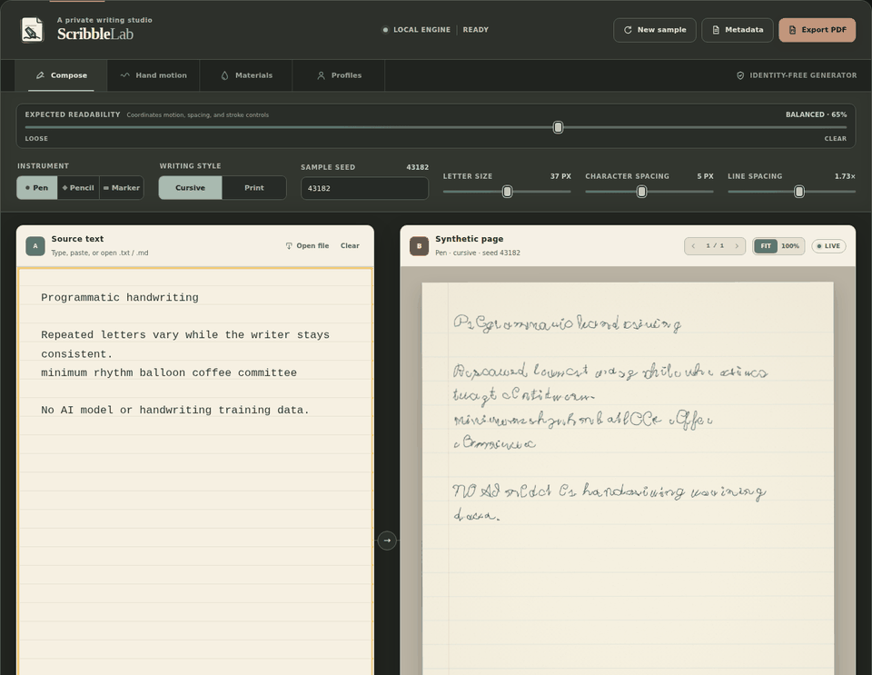
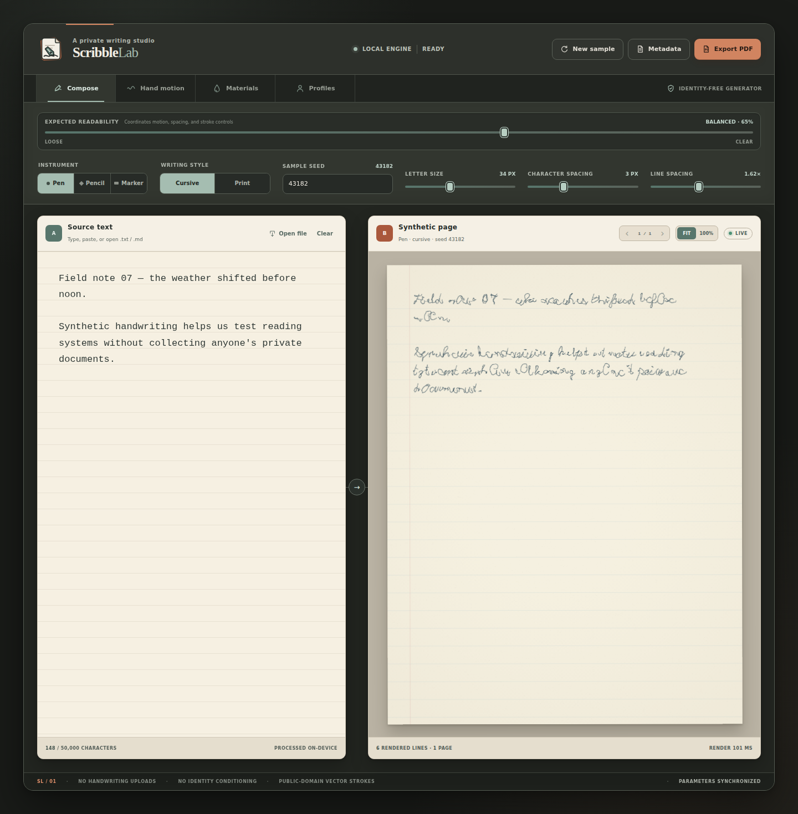
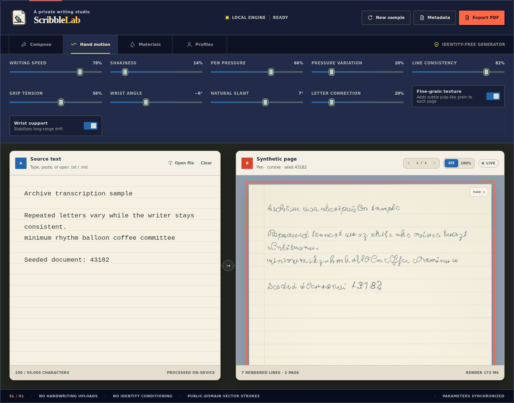
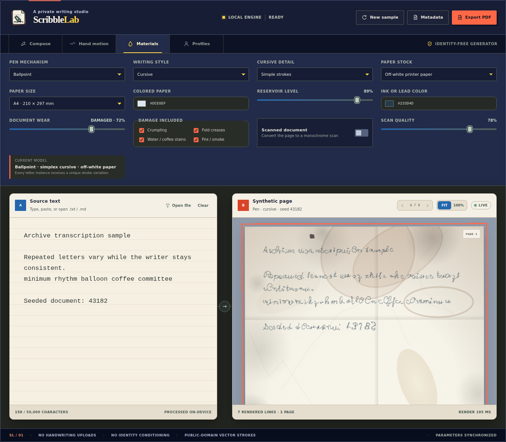
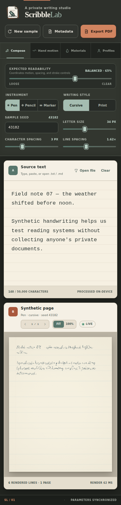

<p align="center">
  
</p>

<h1 align="center">Programmatic Text-to-Handwriting Converter</h1>

<p align="center">
  The Scribble Lab browser app converts text into naturally varied handwriting with programmed vector strokes. It uses no AI model, machine learning, or handwriting training data.
</p>

<p align="center">
  <a href="https://github.com/matt-bat/programmatic-text-to-handwriting-converter/actions/workflows/ci.yml"></a>
  <a href="https://matt-bat.github.io/programmatic-text-to-handwriting-converter/"></a>
  <a href="LICENSE"></a>
  <a href="https://ko-fi.com/matt0bat"></a>
</p>

## What this project is

Scribble Lab is a local-first, programmatic text-to-handwriting converter for cursive and print documents. It does not paste a handwriting font repeatedly and it does not ask an AI to draw the page. Instead, its JavaScript renderer starts with public-domain vector letterforms and applies reproducible geometry, motion, pressure, pen, ink, spacing, and paper rules to every character.

Here, *synthetic handwriting* simply means handwriting-like output rendered by software. It does not mean AI-generated handwriting.

> **No AI is used to generate the handwriting.** The runtime contains no model weights, machine-learning library, training pipeline, inference step, prompt service, or generative-AI API. It never learns from handwriting samples. All generation happens locally through deterministic JavaScript math and Canvas 2D drawing commands.

Because the generator is seeded, the same text, seed, and settings reproduce the same document. Selecting **New sample** changes the seed and produces a different but still deterministic writer and page.

[Try the live browser demo](https://matt-bat.github.io/programmatic-text-to-handwriting-converter/) or follow the local setup below.

## Developer quick start

Prerequisites: Node.js 20+, npm, Python 3.10+, and a current browser.

```bash
git clone https://github.com/matt-bat/programmatic-text-to-handwriting-converter.git
cd programmatic-text-to-handwriting-converter
npm ci
npm start
```

Open `http://127.0.0.1:4173`. The Python process is only a static-file server; the application itself is framework-free browser JavaScript with no build step, backend, API, database, account system, analytics, remote fonts, or environment variables.

Run deterministic unit and syntax checks with `npm run check`. The full Playwright workflow suite is available through `npm run test:browser` after installing its browser binaries.

## How it works, step by step

1. **Read and normalize the input.** The app accepts typed text or a local text/Markdown file. Markdown is converted into handwriting-friendly headings, lists, links, quotations, tables, and code conventions. Text stays in the browser.
2. **Split text into human-readable characters.** A grapheme-aware segmenter keeps accented characters and combined Unicode symbols together, then a word-preserving layout engine wraps lines and paginates the document.
3. **Choose a vector glyph.** Each printable character is mapped to bundled public-domain Hershey stroke coordinates. Cursive and print use different vector constructions; the program does not call a system handwriting font.
4. **Create a seeded writer profile.** A small pseudo-random number generator derives consistent width, height, shear, rotation, motion, shape, and pressure tendencies from the selected seed and writing style.
5. **Vary each character instance.** A seed derived from the document seed, character, and position bends and shifts the glyph's stroke points. Two instances of the same letter keep the same underlying construction but do not have identical geometry.
6. **Carry motion forward.** Position, baseline drift, rotation, width, height, and pressure phase are blended from one glyph to the next. This correlated state makes nearby letters feel as though they came from one moving hand instead of receiving unrelated random jitter.
7. **Apply the physical controls.** Speed, shakiness, grip, wrist support, wrist angle, slant, spacing, and pressure become bounded coefficients for drift, shear, rotation, deformation, and stroke width. The Expected Readability control coordinates these values for users who do not want to tune them individually.
8. **Add cursive connections.** In cursive mode, eligible neighboring letters can receive seeded curved connectors. Their frequency responds to the connection and speed controls. Print mode suppresses them.
9. **Simulate the writing material.** Every path is traversed segment by segment. Ballpoint, fountain pen, pencil, and marker settings change width, layers, spread, opacity, grain, nib direction, and ink continuity. Reservoir level can introduce deterministic thinning or skipped segments.
10. **Draw the paper and pages.** Canvas 2D paints the selected stock, subtle fibers, optional notebook rules, and the transformed strokes onto fixed Letter-proportioned pages.
11. **Preview or export.** The app renders only the selected preview page for responsiveness. PDF export takes one stable document snapshot, renders every page locally, and opens the browser print dialog.

There is no probabilistic model hidden inside these steps. The apparent naturalness comes from several small, bounded variations working together at different scales.

For a code-level walkthrough, read [How programmatic handwriting works](docs/articles/how-programmatic-handwriting-works.md).

## Where the natural variance comes from

Natural-looking variation needs both difference and continuity. Pure randomness would make letters jump around; exact repetition would look like a font. The renderer balances the two:

- **Document-level consistency:** the seed creates one overall writer profile for proportions, slant, rotation, motion, and pressure.
- **Character-level difference:** each glyph instance receives its own repeatable warp, scale, bend, offset, and micro-motion.
- **Neighbor-to-neighbor continuity:** smoothed state carries baseline drift, rotation, size, and pressure phase forward, so changes develop gradually.
- **Tool-specific marks:** pen angle, pressure, reservoir, graphite grain, marker layering, and paper surface alter individual path segments.
- **Seeded reproducibility:** every variation comes from deterministic pseudo-random values. A seed creates variety without making results irreproducible.

This is an approximation of handwriting dynamics, not a biometric model. It is designed to create generic, identity-free writing and cannot learn, copy, match, or authenticate a real person's handwriting.

## Intent and safety

The application is intentionally identity-free. It does not accept handwriting samples, font files, images, signatures, author labels, or other material that could condition the generator on a real person. It does not provide tracing, writer matching, signature generation, or style extraction. Text and Markdown are processed locally in the browser, and saved profiles contain parameters only.

Please use Scribble Lab for synthetic document creation, education, accessibility work, design exploration, and privacy-conscious optical character recognition testing. Do not use it to impersonate a person, reproduce a signature, misrepresent authorship, or create deceptive documents. Read the complete [safety policy](SAFETY.md) before proposing a new input or identity-related feature.

> If Scribble Lab is useful to you, you can [support its continued development on Ko-fi](https://ko-fi.com/matt0bat). Support is optional and helps Matthew Bateman maintain the project.

## What makes it different

- Cursive and non-cursive print use distinct bundled vector constructions.
- Character generation is fully programmatic and uses no AI model or training dataset.
- Every character instance receives seeded geometric deformation.
- Correlated writer state preserves overall consistency across a sample.
- Repeated letters vary without losing their recognizable construction.
- Expected Readability coordinates several physical parameters through one approachable 0 to 100 control, with an extra clarity finish in the final ten percent.
- Detailed controls model speed, pressure, grip tension, wrist angle, slant, spacing, connection, and reservoir level.
- Ballpoint, fountain pen, pencil, and marker models respond differently along each stroke.
- Parameter profiles can be saved locally without retaining source text.
- Plain text and common Markdown structures can be imported up to 50,000 grapheme characters.
- Long documents paginate into Letter-proportioned pages for PDF export.
- The same seed and parameters reproduce the same synthetic document across supported browsers.

## Preview



| Desktop workspace | Hand motion controls |
|:---:|:---:|
|  |  |



<p align="center">
  
</p>

## Create handwriting

1. Type or paste text into the source pane. You can also open a `.txt`, `.md`, or `.markdown` file.
2. Choose Cursive or Print.
3. Move Expected Readability for a coordinated result, or tune the detailed motion and material controls. The established expressive range continues through 90 percent, while 90 to 100 progressively prioritizes larger, steadier, more separated writing.
4. Select New sample to generate a different seeded writer.
5. Save useful parameter combinations as local profiles.
6. Select Export PDF, then choose Save as PDF in the browser print dialog.

Markdown headings, lists, task markers, links, quotes, tables, emphasis, and fenced code are converted into conventions that a person could naturally write by hand.

## Privacy model

- Source text stays in the current browser page.
- Rendering occurs with local Canvas 2D code.
- Profiles use browser storage and contain generic parameters only.
- Export metadata records counts and generator settings, not source text.
- The runtime makes no external network requests.
- No handwriting or identity reference can be uploaded.
- A restrictive browser security policy blocks remote scripts, connections, frames, and embedded objects.
- Character, raw text, file, and saved-profile bounds limit accidental or hostile memory use.

Generated PDF files contain the text you supplied. Store and share those files according to the sensitivity of that text.

## Warranty, responsibility, and liability

Scribble Lab is provided as is, without warranties or guarantees about accuracy, legibility, fitness for a particular purpose, legal suitability, uninterrupted operation, or the acceptability of generated documents. You are responsible for the text you provide, the files you create, compliance with applicable laws and policies, and how generated material is stored, represented, and shared.

To the fullest extent allowed by law, Matthew Bateman and project contributors are not liable for loss, damage, claims, costs, or consequences arising from use, inability to use, misuse, modification, redistribution, or generated output. This is a plain-language summary. The warranty and liability terms in the [license](LICENSE) control, and legal enforceability can vary by jurisdiction.

## Validate the project

Run the syntax and deterministic unit checks:

```bash
npm run check
```

Run the complete browser workflow suite:

```bash
./node_modules/.bin/playwright install chromium firefox webkit
npm run test:browser
```

The browser suite covers Chromium, Firefox, and WebKit. It checks writing-style differences, seeded repeatability, repeated-letter variation, parameter sensitivity, Markdown import, 50,000-character pagination, PDF preparation, responsive layout, keyboard navigation, metadata privacy, local-only runtime behavior, and automated WCAG A and AA rules.

## Project map

```text
index.html                   Application shell and accessible controls
src/app.js                   UI state, document preview, profiles, and PDF preparation
src/document-import.js       Text and Markdown validation and readable formatting
src/handwriting-engine.js    Deterministic pagination and physical stroke simulation
src/stroke-font.js           Bundled vector glyph parsing and measurement
src/assets/                  Public-domain stroke data and project graphics
src/profile-store.js         Bounded browser profile persistence
src/styles.css               Responsive Spatial Canvas visual system
tests/                       Unit and cross-browser workflow tests
docs/architecture.md         Rendering, privacy, and compatibility design
docs/operations.md           Local operation and verification details
docs/contributing/           Focused guides for development, rendering, and documentation changes
docs/license-and-safety-rationale.md
                             Why the project uses a noncommercial license and a strict safety boundary
ROADMAP.md                   Current priorities and contribution ideas
```

## Contributing

Bug reports, accessibility improvements, tests, documentation, and identity-free rendering improvements are welcome. Features that ingest or imitate a real person’s handwriting or signature are outside the project scope and will not be accepted.

Start with [CONTRIBUTING.md](CONTRIBUTING.md), then use the focused [contributor guides](docs/contributing/README.md) for local development, rendering changes, and documentation work. The [roadmap](ROADMAP.md) lists useful areas to help. Read [SAFETY.md](SAFETY.md) and [CODE_OF_CONDUCT.md](CODE_OF_CONDUCT.md) before opening a pull request. Report sensitive security concerns through the private reporting instructions in [SECURITY.md](SECURITY.md).

For usage questions, examples, rendering experiments, and feature design, join [GitHub Discussions](https://github.com/matt-bat/programmatic-text-to-handwriting-converter/discussions). Use Issues for reproducible bugs and scoped implementation requests.

## License and credit

Copyright © 2026 Matthew Bateman.

The current Scribble Lab source is available under the [PolyForm Noncommercial License 1.0.0](LICENSE). You may use, study, modify, and share it only for purposes permitted by that license. Commercial use, profit-seeking paid access or hosting, inclusion in a paid product or service, and use for anticipated business revenue or profit are outside the license grant. The standard license also identifies permitted uses for qualifying noncommercial organizations. Redistributed copies must preserve the license and every `Required Notice:` line in [NOTICE.md](NOTICE.md), including credit to Matthew Bateman.

This is a source-available license, not an OSI-approved open-source license. Copies already received under an earlier AGPL release remain governed by that earlier license. The new license applies to this revised version and later versions released under it.

Read [Why this project uses a restrictive license](docs/license-and-safety-rationale.md) for the plain-language reasoning behind the license and safety boundaries. The license text remains the controlling document.

The bundled Hershey coordinate data is public domain and documented separately in [THIRD_PARTY_ASSETS.md](THIRD_PARTY_ASSETS.md). See [NOTICE.md](NOTICE.md) for attribution and project identity details.
